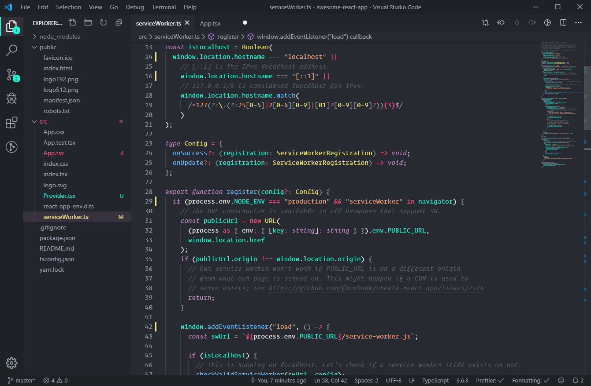

# Crayon

An Operator Mono theme for Visual Studio Code.

---

## Features

- Dark UI elements for reducing eye strain.
- A tiny color palette for minimal visual clutter.

## Installation

1. Open the **Extensions** sidebar in VS Code
2. Search for `Crayon Theme`
3. Install & reload.
4. `⌘ + ⇧ + p` and type "Color Theme".
5. Open the **Command Palette** with `Ctrl + Shift + P` or `⌘ + ⇧ + p`
6. Select **Preferences: Color Theme** and pick Crayon Theme.
7. Enjoy!

### Syntax colors

-  Wild Watermelon **#ff6188** _Tags_
-  Tacao **#fcad83** - _Constantns_
-  Sweet Corn **#f7e87e** - _Types_
-  Malibu **#6fc1ff** - _Functions_
-  Bright Turquoise **#19f9d8** - _Variables_
-  Lilac **#c594c5** - _Keywprd & Storage_
-  Grey Chateau **#9ea7b0** - _Punctuation_
-  Shuttle Gray **#5d656e** - _Comments_
-  Snow **#f9f9f9** - _Misc_

### UI colors

-  Bunker **#1e2126** - _Outline_
-  Black Russian **#22252b** - _Sidebar_
-  Bunker **#272a30** - _Editor_
-  Ebony Clay **#31343b** - _Active_
-  Baltic Sea **#393f45** - _Seperator_
